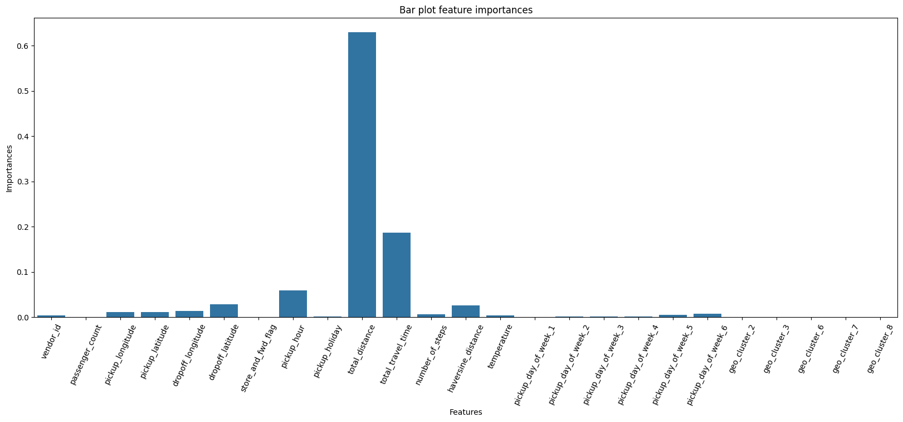

 

# NYC Taxi Trip Duration

This project predicts the duration of taxi rides in New York City using supervised regression models.

The work is implemented in the Jupyter notebook [`NYC_Taxi_Project.ipynb`](NYC_Taxi_Project.ipynb). 

- **Note**: the raw CSV is kept outside version control because of its size. Place it at [here](https://drive.google.com/file/d/1X_EJEfERiXki0SKtbnCL9JDv49Go14lF/view) before running the notebook.

## Project Goal

Build and compare several regression models for estimating `trip_duration` from trip metadata, geospatial information, and engineered features.

## Dataset

The notebook uses one prepared dataset with 1,458,644 rows and the following source columns:

`id`, `vendor_id`, `pickup_datetime`, `dropoff_datetime`, `passenger_count`, `pickup_longitude`, `pickup_latitude`, `dropoff_longitude`, `dropoff_latitude`, `store_and_fwd_flag`, `trip_duration`

The notebook expands these raw fields with additional features such as:

- datetime-based features
- holiday and day-of-week indicators
- geospatial distance features
- weather-related features
- cluster-based location features

## Workflow

1. Load and inspect the raw trip data.
2. Perform exploratory data analysis.
3. Engineer predictive features.
4. Encode categorical variables and scale numeric features where needed.
5. Train and compare several regression models.
6. Evaluate models with RMSLE on a validation split.
7. Use the best model for the final prediction step.

## Models Evaluated

The notebook compares:

- Linear Regression
- Polynomial Regression
- Ridge Regression
- Decision Tree Regressor
- Random Forest Regressor
- Gradient Boosting Regressor

## Results

According to the notebook, the best validation performance was achieved by `GradientBoostingRegressor`.

- Best validation RMSLE: about `0.39`
- Strong baseline models:
  - Linear Regression: about `0.54`
  - Ridge Regression: about `0.48`
  - Random Forest Regressor: about `0.41`

Feature importance is also analyzed for the final tree-based model.



## Repository Structure

- [`NYC_Taxi_Project.ipynb`](NYC_Taxi_Project.ipynb) - main notebook with analysis, feature engineering, and model training
- [`.gitignore`](.gitignore) - ignored files and local environment artifacts
- [`README.md`](README.md) - project overview and usage notes
- [`requirements.txt`](requirements.txt) - Python dependencies required to run the notebook
- [`images/`](images/) - images used in the README

## Using `.gitignore`

The `.gitignore` file tells Git which local files should stay untracked. In this project it already ignores:

- `.DS_Store` files created by macOS
- `.ipynb_checkpoints/` folders created by Jupyter
- `__pycache__/` folders created by Python
- `*.pyc` compiled Python files

If you create new temporary files, logs, or local datasets that should not be committed, add them to `.gitignore` as new lines. Each pattern is matched from the project root, so you can ignore either a specific file name or a whole folder.

## Installation

``` bash
git clone https://github.com/dzianis2785/taxi_trip_duration.git
```

Install dependencies:

``` bash
pip install -r requirements.txt
```

## Run

Launch Jupyter and open the notebook:

```bash
jupyter notebook
```

Then run the cells in `NYC_Taxi_Project.ipynb` from top to bottom.

## Notes

- The project is notebook-driven rather than packaged as a standalone Python module.
- Dependencies in `requirements.txt` are pinned to keep the notebook environment reproducible.
